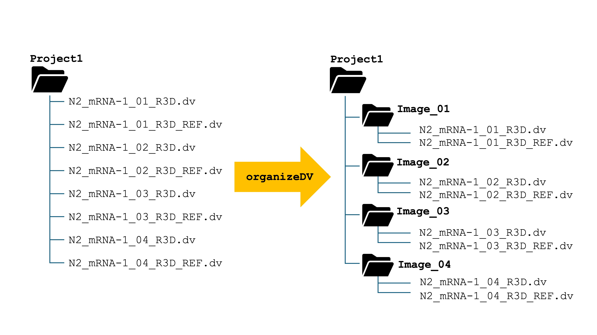

# organizeDV
This script can be used to organize Deltavision Images. This is a pre-processing step for WormLib

# INSTALLATION 

To obtain the code, use git clone to sync a copy of organizeDV to your local directory:

```bash
$ git clone https://github.com/erinosb/organizeDV.git
```

Navigate into the obtained directory:

```bash
$ cd organizeDeltaVision
```

Use **chmod** to make the script organizeDV executable:

```bash
# Check that you are located within the organizeDV directory:
$ pwd
~/your/file/structure/organizeDeltaVision

# Check that you can see the organizeDV script listed in your working directory:
$ ls -alh
drwxr-xr-x@ 14 erinnishimura  staff   448B Dec  8 18:27 .git
-rw-r--r--@  1 erinnishimura  staff   1.0K Dec  8 18:27 LICENSE
-rw-r--r--@  1 erinnishimura  staff   6.7K Dec  8 18:27 organizeDV
-rw-r--r--@  1 erinnishimura  staff   2.8K Dec  8 18:27 README.md

# Change your permissions to allow execusion by the user:
$ chmod +x organizeDV

# Check that permissions are changed:
$ ls -alh organizeDV
drwxr-xr-x@ 14 erinnishimura  staff   448B Dec  8 18:27 .git
-rw-r--r--@  1 erinnishimura  staff   1.0K Dec  8 18:27 LICENSE
-rwxr-xr-x@  1 erinnishimura  staff   6.7K Dec  8 18:27 organizeDV
-rw-r--r--@  1 erinnishimura  staff   2.8K Dec  8 18:27 README.md
```

Now, the script can be executed using the syntax: `./organizeDV` from within the directory where it is located. It should be denoted with an x in the permission code. 

To make the organizeDV script executable from anywhere in your file structure, you will need to add its working directory to your $PATH. Please understand this process before you change your $PATH.

MacOS instructions are given below. Linux instructions should be quite similar though the example file paths will differ.

```bash

# Look up the working directory that contains organizeDV and copy down the absolute address in a scratch space. I'll show an example of Tony Stark's file structure. Yours may look different.
$ pwd
/Users/tonystark/myscripts/oranizeDeltaVision

# Go to your home directory. Example of Tony Stark's. Your should reflect your own name.
$ cd
$ pwd
/Users/tonystark/

# Use ls -alh to find your .zshrc file
# Consider making a backup of your .zshrc file before changing it:
$ cp .zshrc 251208_zshrc_backup.txt

# Next, use nano to open your .zshrc to edit it:
$ nano .zshrc

# Modify the following line of code to include the absolute path your wrote down at the beginning of this code chunk. Follow Tony Stark's lead like so. His pwd was /Users/tonystark/myscripts/oranizeDeltaVision. Copy your corresponding line to the end of the .zshrc file:
export PATH="$PATH:/Users/tonystark/myscripts/oranizeDeltaVision"

# Save the file using CTRL + X. Type "Y" to accept the changes

# Source new .zshrc using the following command: 
$ source .zshrc

```

You should now be able to test out organizeDV like so...

```bash
$ organizeDV -h

Success: organizeDV executed with command line: /Users/erinnishimura/Dropbox/github/organizeDeltaVision/organizeDV

USAGE: organizeDV [-h] [-d <directory>]
 This script takes as default input the current working directory.
 Deltavision image files (_R3D.dv) and reference image files (_R3D_REF.dv) must be located within
 the current working directory or specified directory. File names must be specified like so:
 	N2_mRNA-1_01_R3D.dv
 	N2_mRNA-1_01_R3D_REF.dv
 	N2_mRNA-1_02_R3D.dv
 	N2_mRNA-1_02_R3D_REF.dv
 This script identifies all the R3D.dv and R3D_REF.dv files and organizes them into directories
 	labeled Image_01, Image_02, etc.

 OPTIONS: 
	 -h              Print usage statement

	-d <directory>	Default is working directory (.). Alternatively, specify the desired directory
```

# OPERATION

Start with a file structure on the left. End up with a file structure on the right. 




# USAGE

**USAGE: organize_DV.sh [-h] [-d \<directory\>]**

| Option      | Value | Description    |
| :---        | :---      | :---   |
| -h      |        | Help. Print usage statement   |
| -d   | \<directory\>        | Default is working directory (.). Alternatively, specify the desired directory   |

This script takes as default input the current working directory.

Deltavision image files (_R3D.dv) and reference image files (_R3D_REF.dv) must be located within the current working directory or specified directory. File names must be specified like so:

  * N2_mRNA-1_01_R3D.dv
  * N2_mRNA-1_01_R3D_REF.dv
  * N2_mRNA-1_02_R3D.dv
  * N2_mRNA-1_02_R3D_REF.dv

 This script identifies all the R3D.dv and R3D_REF.dv files and organizes them into directories labeled Image_01, Image_02, etc.

```bash

USAGE:
     organizeDV [ -h ] [ -d <directory> ]

OPTIONS:
     -h              Print usage statement
     -d <directory>  Default is working directory (.). Alternatively, specify the desired directory
```

# KNOWN BUGS

  * Please be aware that if your files do not increment perfectly, the Image_## folder number and the actual image number can move out of sync. If you would like to use the image file name to designate the folder name, please contact Erin Nishimura. This can be added.
  * This script doesn't work for > 99 _R3D.dv files. 

# FUTURE EXPANSION

Ideas for future expanstion will go here.


